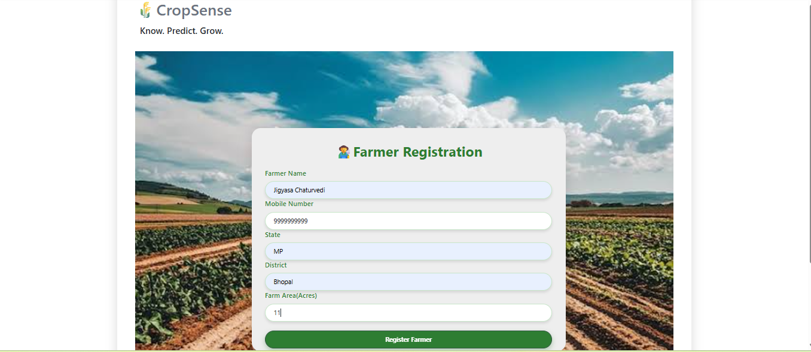
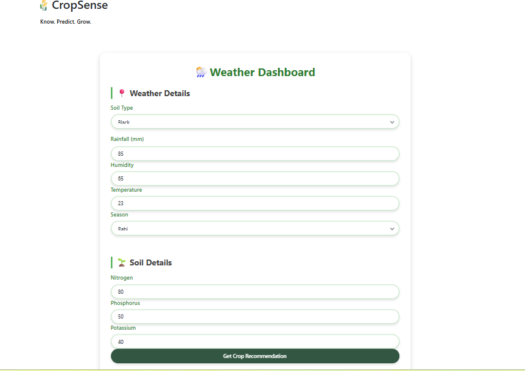
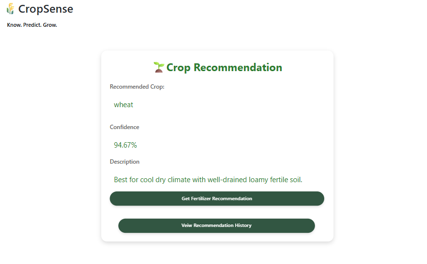
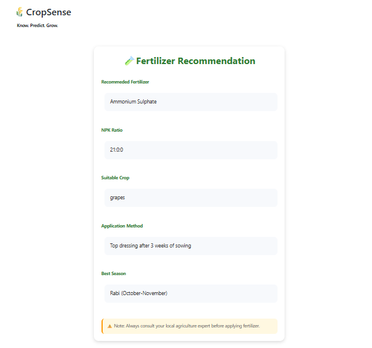

# 🌱 AI-Powered Crop Recommendation System

An AI-powered crop recommendation application developed using **Machine Learning**, **Flask**, and **OutSystems**. The application predicts the most suitable crop based on soil and environmental parameters and also provides fertilizer recommendations through a low-code interface.

---

# 🚀 Tech Stack

- Python
- Flask
- Scikit-learn
- Pandas
- NumPy
- OutSystems
- REST API
- Render (Deployment)
- Git & GitHub

---

# ✨ Features

- Farmer Registration
- Weather Details Dashboard
- AI-Based Crop Recommendation
- Prediction Confidence Score
- Fertilizer Recommendation
- Interactive Low-Code User Interface
- REST API Integration
- Cloud Deployment using Render

---

# 🏗️ System Architecture

```text
                    Farmer Registration
                            │
                            ▼
                 OutSystems Frontend
                            │
                     REST API Request
                            │
                            ▼
                     Flask Backend
                            │
                            ▼
                 Machine Learning Model
                            │
              ┌─────────────┴─────────────┐
              ▼                           ▼
     Crop Recommendation      Fertilizer Recommendation
```

---

# 📸 Application Screens

## Farmer Registration



---

## Weather Dashboard



---

## Crop Recommendation



---

## Fertilizer Recommendation



---

# 📁 Project Structure

```text
AI-Crop-Recommendation-System/
│
├── Backend/
│   ├── app.py
│   ├── Crop_recommendation.csv
│   ├── requirements.txt
│   ├── crop_model.pkl
│   ├── scaler.pkl
│   ├── label_encoder.pkl
│   └── static/
│       └── images/
│
├── OutSystems/
│   └── CropRecommendationApp.oml
│
│── FarmerRegistration.png
│── WeatherDashboard.png
│── CropRecommendation.png
│── FertilizerRecommendation.png
│   
│
└── README.md
```

---

# 🤖 Machine Learning

- Algorithm: Random Forest Classifier
- Feature Scaling: StandardScaler
- Label Encoding: LabelEncoder
- Confidence Score using Prediction Probability

---

# 🌐 Deployment

The Flask backend is deployed on **Render** and communicates with the OutSystems application through REST APIs.

---

# 📦 OutSystems Module

The complete OutSystems application is available in:

```text
OutSystems/CropRecommendationApp.oml
```

Import this module into OutSystems Service Studio to run the frontend application.

---

# 👩‍💻 Author

**Jigyasa Chaturvedi**

B.Tech – Artificial Intelligence & Machine Learning
